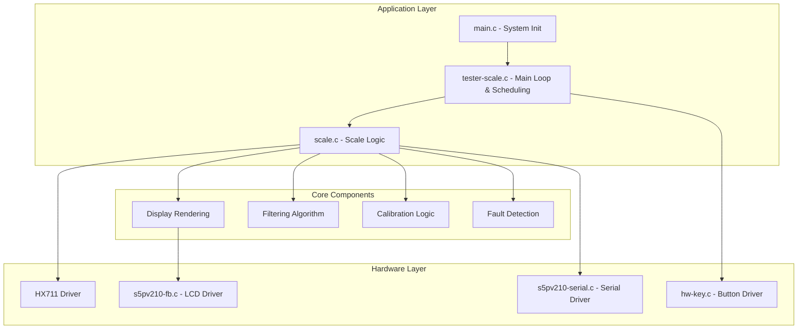

# Electronic Scale (Scale) - S5PV210 Project Code Wiki

## 1. Project Overview

This is an embedded electronic scale project based on the S5PV210 (ARM Cortex-A8) microcontroller, featuring HX711 sensor integration, LCD display, button interaction, serial calibration, and comprehensive fault handling mechanisms.

### Key Features
- Non-blocking scheduling based on Tick division (independent sampling/key/rendering)
- TARE function for zeroing the scale
- Real-time calibration via serial input of reference weight
- Filtering algorithms (outlier removal + exponential smoothing)
- Sensor protection with multiple fault detection mechanisms
- Double-confirmation for calibration to prevent accidental triggers

## 2. Project Architecture

### System Architecture



### Component Responsibilities

| Component | Responsibility | Files |
|-----------|----------------|-------|
| System Initialization | Initialize hardware peripherals | [main.c](file:///workspace/source/main.c) |
| Main Loop | Non-blocking task scheduling | [tester-scale.c](file:///workspace/source/tester-scale.c) |
| Scale Logic | Sampling, filtering, calibration, rendering | [scale.c](file:///workspace/source/scale.c) |
| HX711 Driver | Communicate with weight sensor | [hx711.c](file:///workspace/source/hardware/hx711.c) |
| LCD Driver | Display output | [s5pv210-fb.c](file:///workspace/source/hardware/s5pv210-fb.c) |
| Button Driver | Handle user input | [hw-key.c](file:///workspace/source/hardware/hw-key.c) |
| Serial Driver | Debug output and calibration input | [s5pv210-serial.c](file:///workspace/source/hardware/s5pv210-serial.c) |

## 3. Directory Structure

```
/
├── include/                # Header files
│   ├── main.h              # Main header
│   ├── scale.h             # Scale configuration and interface
│   ├── hardware/           # Hardware driver headers
│   │   ├── hx711.h         # HX711 sensor header
│   │   ├── s5pv210-fb.h    # Framebuffer header
│   │   ├── hw-key.h        # Button header
│   │   └── ...             # Other hardware headers
│   ├── graphic/            # Graphics library
│   └── library/            # C standard library replacements
├── source/                 # Source code
│   ├── main.c              # System initialization
│   ├── tester-scale.c      # Main loop and scheduling
│   ├── scale.c             # Scale logic
│   ├── hardware/           # Hardware drivers
│   │   ├── hx711.c         # HX711 sensor driver
│   │   ├── s5pv210-fb.c    # Framebuffer driver
│   │   ├── hw-key.c        # Button driver
│   │   └── ...             # Other hardware drivers
│   ├── graphic/            # Graphics implementation
│   └── library/            # C standard library implementations
├── tools/                  # Utility tools
│   ├── linux/              # Linux tools
│   └── windows/            # Windows tools
├── Makefile                # Build configuration
├── link.ld                 # Linker script
└── README.md               # Project documentation
```

## 4. Core Data Structures

### Scale State Structure

```c
struct scale_state_t {
    s32_t raw;                 // Raw ADC value
    s32_t tare_raw;            // Tare (zero) raw value
    s32_t samples[SCALE_RAW_FILTER_SIZE];  // Sample buffer for filtering
    s64_t sample_sum;          // Sum of samples for quick average calculation
    u32_t sample_idx;          // Current sample index in buffer
    u32_t sample_count;        // Number of valid samples
    float grams;               // Calculated weight in grams
    float counts_per_gram;     // Calibration factor
    float last_reference_grams; // Last calibration reference weight
    u32_t frame;               // Frame counter for display animations
    u32_t sensor_fail_count;   // Count of sensor read failures
    bool_t sensor_fault;       // Sensor fault flag
    bool_t sensor_fault_reported; // Fault reporting flag
    bool_t cal_ready;          // Calibration ready flag
    bool_t unstable;           // Data instability flag
    bool_t overload;           // Overload flag
    bool_t invalid_scale;      // Invalid scale factor flag
};
```

## 5. Key Functions

### System Initialization

#### `do_system_initial()`
- **Purpose**: Initialize all system peripherals
- **Location**: [main.c](file:///workspace/source/main.c#L6-L19)
- **Responsibilities**:
  - Initialize memory allocation
  - Initialize clock system
  - Initialize interrupt controller
  - Initialize tick timer
  - Initialize serial port
  - Initialize framebuffer (LCD)
  - Initialize LEDs, beeper, and buttons

### Main Loop

#### `tester_scale()`
- **Purpose**: Main application loop with non-blocking scheduling
- **Location**: [tester-scale.c](file:///workspace/source/tester-scale.c#L37-L107)
- **Key Features**:
  - Initializes HX711 sensor
  - Sets up LCD screen
  - Initializes scale state
  - Implements three parallel tasks with different periods:
    - Sampling (50ms): `scale_update_raw()` and `scale_update_grams()`
    - Key scanning (10ms): `scale_handle_keydown()`
    - Screen rendering (80ms): `scale_render()`

### Scale Logic

#### `scale_update_raw()`
- **Purpose**: Read raw data from HX711 and apply filtering
- **Location**: [scale.c](file:///workspace/source/scale.c#L231-L272)
- **Process**:
  1. Read raw value from HX711
  2. Update sample buffer
  3. Calculate trimmed average (remove min/max)
  4. Apply exponential smoothing
  5. Detect stability based on sample span
  6. Handle sensor faults

#### `scale_update_grams()`
- **Purpose**: Convert raw ADC values to grams
- **Location**: [scale.c](file:///workspace/source/scale.c#L434-L466)
- **Process**:
  1. Get calibration factor
  2. Check for valid scale factor
  3. Calculate grams from raw value and tare
  4. Apply zero threshold
  5. Check for overload conditions

#### `scale_handle_keydown()`
- **Purpose**: Handle button presses
- **Location**: [scale.c](file:///workspace/source/scale.c#L360-L424)
- **Functions**:
  - **POWER button**: Set tare (zero point)
  - **MENU button**: Enter calibration mode (requires double press)

#### `scale_commit_calibration()`
- **Purpose**: Perform calibration with reference weight
- **Location**: [scale.c](file:///workspace/source/scale.c#L274-L321)
- **Process**:
  1. Validate reference weight range
  2. Check for sufficient samples
  3. Check for stable data
  4. Calculate counts per gram
  5. Validate calibration factor
  6. Update scale state

#### `scale_render()`
- **Purpose**: Render scale information on LCD
- **Location**: [scale.c](file:///workspace/source/scale.c#L468-L507)
- **Displays**:
  - Weight in grams
  - Calibration status
  - Stability status
  - Overload status
  - Sensor fault status
  - Button hints

### HX711 Driver

#### `hx711_init()`
- **Purpose**: Initialize HX711 sensor interface
- **Location**: [hardware/hx711.c](file:///workspace/source/hardware/hx711.c#L48-L61)
- **Responsibilities**:
  - Configure GPIO pins
  - Set up DOUT as input
  - Set up SCK as output
  - Enable pull-up on DOUT

#### `hx711_read_raw()`
- **Purpose**: Read raw 24-bit value from HX711
- **Location**: [hardware/hx711.c](file:///workspace/source/hardware/hx711.c#L63-L101)
- **Process**:
  1. Wait for DOUT to go low (ready signal)
  2. Read 24 bits of data
  3. Send clock pulses to select channel A with gain 128
  4. Sign-extend the 24-bit value

## 6. Filtering Algorithm

### Implementation
The scale uses a two-stage filtering process:

1. **Trimmed Average**:
   - Collects 8 samples in a circular buffer
   - Removes the minimum and maximum values
   - Averages the remaining 6 samples
   - **Location**: [scale.c](file:///workspace/source/scale.c#L76-L113)

2. **Exponential Smoothing**:
   - Applies a weighted average: `raw = (prev_raw * 3 + filtered) / 4`
   - Reduces noise while maintaining responsiveness
   - **Location**: [scale.c](file:///workspace/source/scale.c#L250)

3. **Stability Detection**:
   - Calculates the span between min and max samples
   - If span < 1200, data is considered stable
   - **Location**: [scale.c](file:///workspace/source/scale.c#L115-L140)

## 7. Fault Handling

| Fault Type | Trigger Condition | Handling | Recovery |
|------------|------------------|----------|----------|
| **HX711 Timeout** | >100 consecutive read failures | Set sensor_fault flag, display error | Automatic when reads succeed |
| **Unstable Data** | Sample span > 1200 | Set unstable flag, display "UNSTABLE" | Automatic when data stabilizes |
| **Overload** | Weight > 5000g or < -500g | Set overload flag, display "OVERLOAD" | Automatic when weight returns to range |
| **Invalid Scale** | Calibration factor outside valid range | Set invalid_scale flag, display error | Recalibration required |

## 8. Calibration Process

### Steps
1. **Initiation**:
   - Press MENU button once (prompt appears)
   - Press MENU button again within 1 second to confirm

2. **Reference Weight Input**:
   - Serial prompt: "[CAL] Put known weight on scale, then type grams in serial."
   - Enter reference weight (e.g., "500" for 500 grams)

3. **Calculation**:
   - System calculates `counts_per_gram = (raw - tare_raw) / reference_grams`
   - Validates the calculated factor

4. **Confirmation**:
   - Displays "CAL OK" on screen
   - Outputs calibration factor to serial

### Calibration Constants
- **Reference Range**: 1.0g to 50000.0g
- **Scale Factor Range**: 10.0 to 50000.0 counts/gram
- **Default Reference**: 500.0g

## 9. Hardware Configuration

### HX711 Connection
- **DOUT** (Data Output): S5PV210 GPB_2
- **SCK** (Clock Input): S5PV210 GPB_0
- **VCC**: 3.3V
- **GND**: GND

### Button Mapping
- **POWER** (GPH0_1): TARE function
- **MENU** (GPH2_3): Calibration function

### LCD Configuration
- **Resolution**: 1024×600
- **Refresh Rate**: 60Hz

## 10. Build and Run

### Build Process
1. **Compile**:
   ```bash
   make.exe -f Makefile
   ```
   or use VS Code task: `Ctrl+Shift+B` → `build x210`

2. **Output Files**:
   - `output/scale.elf` - Debug ELF file
   - `output/scale.bin` - Binary for burning

### Flashing to Development Board

#### Method 1: Serial Download (DNW)
- **Load Address**: 0x30000000
- **Binary File**: output/scale.bin
- **Baud Rate**: 115200

#### Method 2: SD Card Boot
- Use `tools/windows/SDcardBurner.exe` or `tools/windows/mkv210.exe`

## 11. Serial Interface

### Startup Output
```
========================================
  Electronic Scale v1.0
========================================
Scale factor: 430.00 counts/gram
POWER:TARE
MENU:CALIBRATE (INPUT REFERENCE GRAMS IN SERIAL)
Default ref hint: 500.00g
Ref range: 1.0 g to 50000.0 g
Display range: -500.0 g to 5000.0 g
HX711 DOUT: GPB_2, SCK: GPB_0
========================================
```

### Calibration Example
```
[CAL] Press MENU again within 1s to confirm.
[CAL] Put known weight on scale, then type grams in serial.
CAL REF (g)> 500
[CAL] Reference: 500.00 g, factor: 280.50 counts/gram
```

### Fault Messages
```
[SCALE] HX711 read timeout or sensor disconnected.
[SCALE] HX711 recovered.
[TARE] Zero point set.
```

## 12. Performance Considerations

### Sampling Period
- **HX711 Conversion Time**: ~12.5ms @ 80SPS
- **Recommended Sampling Period**: ≥ 25ms
- **Current Setting**: 50ms (provides sufficient margin)

### Memory Usage
- **Code Size**: ~160KB (binary)
- **RAM Usage**: Minimal (primarily for scale state and sample buffer)

## 13. Troubleshooting

### Common Issues

| Issue | Possible Cause | Solution |
|-------|----------------|----------|
| **Weight stuck at a value** | HX711 timeout due to short sampling period | Increase `SCALE_SAMPLE_PERIOD_MS` to ≥ 50ms |
| **Left side of screen模糊** | LCD panel parameter mismatch | Check LCD configuration in `s5pv210-fb.c` |
| **Buttons not responding** | GPIO initialization error | Check `hw-key.c` for correct pin assignments |
| **Incorrect calibration** | Reference weight error or uneven loading | Ensure accurate reference weight and proper loading |

## 14. Configuration Parameters

### Key Constants (in `scale.h`)

| Parameter | Default Value | Description |
|-----------|---------------|-------------|
| `SCALE_COUNTS_PER_GRAM` | 430.0f | Default calibration factor |
| `SCALE_RAW_FILTER_SIZE` | 8 | Number of samples for filtering |
| `SCALE_SENSOR_FAIL_LIMIT` | 100 | Consecutive failures before fault |
| `SCALE_HX711_READ_TIMEOUT_MS` | 100 | Timeout for HX711 read |
| `SCALE_MAX_DISPLAY_GRAMS` | 5000.0f | Maximum displayable weight |
| `SCALE_MIN_DISPLAY_GRAMS` | -500.0f | Minimum displayable weight |
| `SCALE_STABLE_RAW_SPAN_MAX` | 1200 | Maximum span for stable reading |

## 15. Future Enhancements

1. **Persistent Calibration Storage**: Save calibration factor to non-volatile memory
2. **Multiple Unit Support**: Add kg, oz, lb units
3. **Data Logging**: Log weight measurements to SD card
4. **Wireless Connectivity**: Add Bluetooth or Wi-Fi for remote monitoring
5. **Advanced Filtering**: Implement adaptive filtering for different load types
6. **Self-diagnostic**: Automatic sensor health checks

## 16. Dependencies

| Component | Dependency | Purpose |
|-----------|------------|---------|
| Scale Logic | HX711 Driver | Weight sensor interface |
| Scale Logic | Graphics Library | LCD rendering |
| Scale Logic | Button Driver | User input |
| Scale Logic | Serial Driver | Calibration and debugging |
| Main Loop | Tick Timer | Task scheduling |
| All Components | C Library | Basic functions |

## 17. Conclusion

This electronic scale project demonstrates a complete embedded system implementation with:

- **Robust Sensor Integration**: HX711 driver with error handling
- **Advanced Filtering**: Trimmed average + exponential smoothing for accurate measurements
- **User-Friendly Interface**: LCD display with clear status indicators
- **Safe Operation**: Double-confirmation for calibration and comprehensive fault detection
- **Efficient Scheduling**: Non-blocking multi-tasking with optimized periods

The codebase is well-structured, modular, and provides a solid foundation for further enhancements and customization.