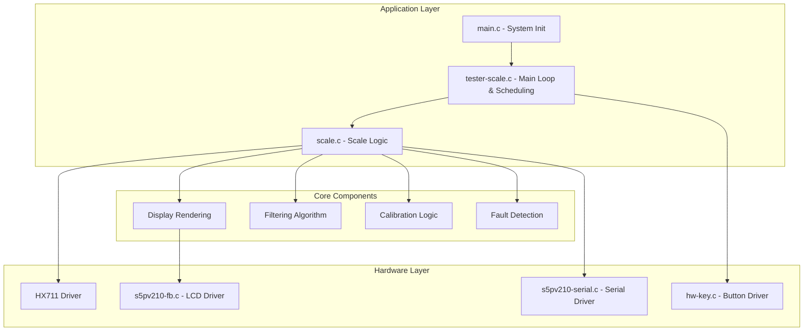

# Electronic Scale (Scale) - S5PV210 Project Code Wiki

## 1. Project Overview

This is an embedded electronic scale project based on the S5PV210 (ARM Cortex-A8) microcontroller, featuring HX711 sensor integration, LCD display, button interaction, serial calibration, and comprehensive fault handling mechanisms.

### Key Features
- Non-blocking scheduling based on Tick division (independent sampling/key/rendering)
- TARE function for zeroing the scale
- Real-time calibration via serial input of reference weight
- Filtering algorithms (outlier removal + exponential smoothing)
- Sensor protection with multiple fault detection mechanisms
- Double-confirmation for calibration to prevent accidental triggers

## 2. Project Architecture

### System Architecture



### Component Responsibilities

| Component | Responsibility | Files |
|-----------|----------------|-------|
| System Initialization | Initialize hardware peripherals | [main.c](file:///workspace/source/main.c) |
| Main Loop | Non-blocking task scheduling | [tester-scale.c](file:///workspace/source/tester-scale.c) |
| Scale Logic | Sampling, filtering, calibration, rendering | [scale.c](file:///workspace/source/scale.c) |
| HX711 Driver | Communicate with weight sensor | [hx711.c](file:///workspace/source/hardware/hx711.c) |
| LCD Driver | Display output | [s5pv210-fb.c](file:///workspace/source/hardware/s5pv210-fb.c) |
| Button Driver | Handle user input | [hw-key.c](file:///workspace/source/hardware/hw-key.c) |
| Serial Driver | Debug output and calibration input | [s5pv210-serial.c](file:///workspace/source/hardware/s5pv210-serial.c) |

## 3. Directory Structure

```
/
├── include/                # Header files
│   ├── main.h              # Main header
│   ├── scale.h             # Scale configuration and interface
│   ├── hardware/           # Hardware driver headers
│   │   ├── hx711.h         # HX711 sensor header
│   │   ├── s5pv210-fb.h    # Framebuffer header
│   │   ├── hw-key.h        # Button header
│   │   └── ...             # Other hardware headers
│   ├── graphic/            # Graphics library
│   └── library/            # C standard library replacements
├── source/                 # Source code
│   ├── main.c              # System initialization
│   ├── tester-scale.c      # Main loop and scheduling
│   ├── scale.c             # Scale logic
│   ├── hardware/           # Hardware drivers
│   │   ├── hx711.c         # HX711 sensor driver
│   │   ├── s5pv210-fb.c    # Framebuffer driver
│   │   ├── hw-key.c        # Button driver
│   │   └── ...             # Other hardware drivers
│   ├── graphic/            # Graphics implementation
│   └── library/            # C standard library implementations
├── tools/                  # Utility tools
│   ├── linux/              # Linux tools
│   └── windows/            # Windows tools
├── Makefile                # Build configuration
├── link.ld                 # Linker script
└── README.md               # Project documentation
```

## 4. Core Data Structures

### Scale State Structure

```c
struct scale_state_t {
    s32_t raw;                 // Raw ADC value
    s32_t tare_raw;            // Tare (zero) raw value
    s32_t samples[SCALE_RAW_FILTER_SIZE];  // Sample buffer for filtering
    s64_t sample_sum;          // Sum of samples for quick average calculation
    u32_t sample_idx;          // Current sample index in buffer
    u32_t sample_count;        // Number of valid samples
    float grams;               // Calculated weight in grams
    float counts_per_gram;     // Calibration factor
    float last_reference_grams; // Last calibration reference weight
    u32_t frame;               // Frame counter for display animations
    u32_t sensor_fail_count;   // Count of sensor read failures
    bool_t sensor_fault;       // Sensor fault flag
    bool_t sensor_fault_reported; // Fault reporting flag
    bool_t cal_ready;          // Calibration ready flag
    bool_t unstable;           // Data instability flag
    bool_t overload;           // Overload flag
    bool_t invalid_scale;      // Invalid scale factor flag
};
```

## 5. Key Functions

### System Initialization

#### `do_system_initial()`
- **Purpose**: Initialize all system peripherals
- **Location**: [main.c](file:///workspace/source/main.c#L6-L19)
- **Responsibilities**:
  - Initialize memory allocation
  - Initialize clock system
  - Initialize interrupt controller
  - Initialize tick timer
  - Initialize serial port
  - Initialize framebuffer (LCD)
  - Initialize LEDs, beeper, and buttons

### Main Loop

#### `tester_scale()`
- **Purpose**: Main application loop with non-blocking scheduling
- **Location**: [tester-scale.c](file:///workspace/source/tester-scale.c#L37-L107)
- **Key Features**:
  - Initializes HX711 sensor
  - Sets up LCD screen
  - Initializes scale state
  - Implements three parallel tasks with different periods:
    - Sampling (50ms): `scale_update_raw()` and `scale_update_grams()`
    - Key scanning (10ms): `scale_handle_keydown()`
    - Screen rendering (80ms): `scale_render()`

### Scale Logic

#### `scale_update_raw()`
- **Purpose**: Read raw data from HX711 and apply filtering
- **Location**: [scale.c](file:///workspace/source/scale.c#L231-L272)
- **Process**:
  1. Read raw value from HX711
  2. Update sample buffer
  3. Calculate trimmed average (remove min/max)
  4. Apply exponential smoothing
  5. Detect stability based on sample span
  6. Handle sensor faults

#### `scale_update_grams()`
- **Purpose**: Convert raw ADC values to grams
- **Location**: [scale.c](file:///workspace/source/scale.c#L434-L466)
- **Process**:
  1. Get calibration factor
  2. Check for valid scale factor
  3. Calculate grams from raw value and tare
  4. Apply zero threshold
  5. Check for overload conditions

#### `scale_handle_keydown()`
- **Purpose**: Handle button presses
- **Location**: [scale.c](file:///workspace/source/scale.c#L360-L424)
- **Functions**:
  - **POWER button**: Set tare (zero point)
  - **MENU button**: Enter calibration mode (requires double press)

#### `scale_commit_calibration()`
- **Purpose**: Perform calibration with reference weight
- **Location**: [scale.c](file:///workspace/source/scale.c#L274-L321)
- **Process**:
  1. Validate reference weight range
  2. Check for sufficient samples
  3. Check for stable data
  4. Calculate counts per gram
  5. Validate calibration factor
  6. Update scale state

#### `scale_render()`
- **Purpose**: Render scale information on LCD
- **Location**: [scale.c](file:///workspace/source/scale.c#L468-L507)
- **Displays**:
  - Weight in grams
  - Calibration status
  - Stability status
  - Overload status
  - Sensor fault status
  - Button hints

### HX711 Driver

#### `hx711_init()`
- **Purpose**: Initialize HX711 sensor interface
- **Location**: [hardware/hx711.c](file:///workspace/source/hardware/hx711.c#L48-L61)
- **Responsibilities**:
  - Configure GPIO pins
  - Set up DOUT as input
  - Set up SCK as output
  - Enable pull-up on DOUT

#### `hx711_read_raw()`
- **Purpose**: Read raw 24-bit value from HX711
- **Location**: [hardware/hx711.c](file:///workspace/source/hardware/hx711.c#L63-L101)
- **Process**:
  1. Wait for DOUT to go low (ready signal)
  2. Read 24 bits of data
  3. Send clock pulses to select channel A with gain 128
  4. Sign-extend the 24-bit value

## 6. Filtering Algorithm

### Implementation
The scale uses a two-stage filtering process:

1. **Trimmed Average**:
   - Collects 8 samples in a circular buffer
   - Removes the minimum and maximum values
   - Averages the remaining 6 samples
   - **Location**: [scale.c](file:///workspace/source/scale.c#L76-L113)

2. **Exponential Smoothing**:
   - Applies a weighted average: `raw = (prev_raw * 3 + filtered) / 4`
   - Reduces noise while maintaining responsiveness
   - **Location**: [scale.c](file:///workspace/source/scale.c#L250)

3. **Stability Detection**:
   - Calculates the span between min and max samples
   - If span < 1200, data is considered stable
   - **Location**: [scale.c](file:///workspace/source/scale.c#L115-L140)

## 7. Fault Handling

| Fault Type | Trigger Condition | Handling | Recovery |
|------------|------------------|----------|----------|
| **HX711 Timeout** | >100 consecutive read failures | Set sensor_fault flag, display error | Automatic when reads succeed |
| **Unstable Data** | Sample span > 1200 | Set unstable flag, display "UNSTABLE" | Automatic when data stabilizes |
| **Overload** | Weight > 5000g or < -500g | Set overload flag, display "OVERLOAD" | Automatic when weight returns to range |
| **Invalid Scale** | Calibration factor outside valid range | Set invalid_scale flag, display error | Recalibration required |

## 8. Calibration Process

### Steps
1. **Initiation**:
   - Press MENU button once (prompt appears)
   - Press MENU button again within 1 second to confirm

2. **Reference Weight Input**:
   - Serial prompt: "[CAL] Put known weight on scale, then type grams in serial."
   - Enter reference weight (e.g., "500" for 500 grams)

3. **Calculation**:
   - System calculates `counts_per_gram = (raw - tare_raw) / reference_grams`
   - Validates the calculated factor

4. **Confirmation**:
   - Displays "CAL OK" on screen
   - Outputs calibration factor to serial

### Calibration Constants
- **Reference Range**: 1.0g to 50000.0g
- **Scale Factor Range**: 10.0 to 50000.0 counts/gram
- **Default Reference**: 500.0g

## 9. Hardware Configuration

### HX711 Connection
- **DOUT** (Data Output): S5PV210 GPB_2
- **SCK** (Clock Input): S5PV210 GPB_0
- **VCC**: 3.3V
- **GND**: GND

### Button Mapping
- **POWER** (GPH0_1): TARE function
- **MENU** (GPH2_3): Calibration function

### LCD Configuration
- **Resolution**: 1024×600
- **Refresh Rate**: 60Hz

## 10. Build and Run

### Build Process
1. **Compile**:
   ```bash
   make.exe -f Makefile
   ```
   or use VS Code task: `Ctrl+Shift+B` → `build x210`

2. **Output Files**:
   - `output/scale.elf` - Debug ELF file
   - `output/scale.bin` - Binary for burning

### Flashing to Development Board

#### Method 1: Serial Download (DNW)
- **Load Address**: 0x30000000
- **Binary File**: output/scale.bin
- **Baud Rate**: 115200

#### Method 2: SD Card Boot
- Use `tools/windows/SDcardBurner.exe` or `tools/windows/mkv210.exe`

## 11. Serial Interface

### Startup Output
```
========================================
  Electronic Scale v1.0
========================================
Scale factor: 430.00 counts/gram
POWER:TARE
MENU:CALIBRATE (INPUT REFERENCE GRAMS IN SERIAL)
Default ref hint: 500.00g
Ref range: 1.0 g to 50000.0 g
Display range: -500.0 g to 5000.0 g
HX711 DOUT: GPB_2, SCK: GPB_0
========================================
```

### Calibration Example
```
[CAL] Press MENU again within 1s to confirm.
[CAL] Put known weight on scale, then type grams in serial.
CAL REF (g)> 500
[CAL] Reference: 500.00 g, factor: 280.50 counts/gram
```

### Fault Messages
```
[SCALE] HX711 read timeout or sensor disconnected.
[SCALE] HX711 recovered.
[TARE] Zero point set.
```

## 12. Performance Considerations

### Sampling Period
- **HX711 Conversion Time**: ~12.5ms @ 80SPS
- **Recommended Sampling Period**: ≥ 25ms
- **Current Setting**: 50ms (provides sufficient margin)

### Memory Usage
- **Code Size**: ~160KB (binary)
- **RAM Usage**: Minimal (primarily for scale state and sample buffer)

## 13. Troubleshooting

### Common Issues

| Issue | Possible Cause | Solution |
|-------|----------------|----------|
| **Weight stuck at a value** | HX711 timeout due to short sampling period | Increase `SCALE_SAMPLE_PERIOD_MS` to ≥ 50ms |
| **Left side of screen模糊** | LCD panel parameter mismatch | Check LCD configuration in `s5pv210-fb.c` |
| **Buttons not responding** | GPIO initialization error | Check `hw-key.c` for correct pin assignments |
| **Incorrect calibration** | Reference weight error or uneven loading | Ensure accurate reference weight and proper loading |

## 14. Configuration Parameters

### Key Constants (in `scale.h`)

| Parameter | Default Value | Description |
|-----------|---------------|-------------|
| `SCALE_COUNTS_PER_GRAM` | 430.0f | Default calibration factor |
| `SCALE_RAW_FILTER_SIZE` | 8 | Number of samples for filtering |
| `SCALE_SENSOR_FAIL_LIMIT` | 100 | Consecutive failures before fault |
| `SCALE_HX711_READ_TIMEOUT_MS` | 100 | Timeout for HX711 read |
| `SCALE_MAX_DISPLAY_GRAMS` | 5000.0f | Maximum displayable weight |
| `SCALE_MIN_DISPLAY_GRAMS` | -500.0f | Minimum displayable weight |
| `SCALE_STABLE_RAW_SPAN_MAX` | 1200 | Maximum span for stable reading |

## 15. Future Enhancements

1. **Persistent Calibration Storage**: Save calibration factor to non-volatile memory
2. **Multiple Unit Support**: Add kg, oz, lb units
3. **Data Logging**: Log weight measurements to SD card
4. **Wireless Connectivity**: Add Bluetooth or Wi-Fi for remote monitoring
5. **Advanced Filtering**: Implement adaptive filtering for different load types
6. **Self-diagnostic**: Automatic sensor health checks

## 16. Dependencies

| Component | Dependency | Purpose |
|-----------|------------|---------|
| Scale Logic | HX711 Driver | Weight sensor interface |
| Scale Logic | Graphics Library | LCD rendering |
| Scale Logic | Button Driver | User input |
| Scale Logic | Serial Driver | Calibration and debugging |
| Main Loop | Tick Timer | Task scheduling |
| All Components | C Library | Basic functions |

## 17. 核心概念详解

### 17.1 清晰的状态显示 (Clear Status Display)

**在项目中的作用**：
- 实时向用户展示电子秤的工作状态，包括重量、稳定性、过载情况、传感器故障等
- 提供直观的操作提示（按键功能说明）
- 增强用户体验，让用户快速了解当前秤的工作状态

**输入与输出**：
- **输入**：`scale_state_t` 结构中的状态信息（`grams`, `unstable`, `overload`, `sensor_fault`, `cal_ready` 等）
- **输出**：LCD 屏幕上的可视化界面
  - 重量数值（大字体显示）
  - 状态标签（"UNSTABLE", "OVERLOAD", "HX711 ERROR", "CAL OK" 等）
  - 操作提示

**原理**：
```c
void scale_render(struct surface_t * screen, struct scale_state_t * state)
{
    fill_rect(screen, 0, 0, screen->w, screen->h, g_colors.bg);
    
    // 根据不同状态显示不同信息
    if(state->sensor_fault) {
        // 显示传感器故障信息
        screen_printf(screen, 310, 90, 7, g_colors.warn, "HX711 ERROR");
    } else {
        // 显示正常重量
        screen_printf(screen, 380, 90, 10, g_colors.fg, "%7.2f", state->grams);
        // 显示状态标识
        if(state->unstable)
            screen_printf(screen, 300, 345, 4, g_colors.warn, "UNSTABLE");
        else if(state->overload)
            screen_printf(screen, 300, 345, 4, g_colors.warn, "OVERLOAD");
    }
}
```
- 使用不同颜色区分不同状态（绿色表示正常，橙色表示警告，红色表示错误）
- 根据 `scale_state_t` 中的标志位选择显示内容
- 实时更新屏幕（每 80ms 刷新一次）

**关键代码位置**：[scale.c](file:///workspace/source/scale.c#L468-L507)

---

### 17.2 安全运行：校准双重确认 (Safe Operation: Double Confirmation for Calibration)

**在项目中的作用**：
- 防止误触导致的意外校准操作
- 确保用户确实想要进入校准模式
- 提高系统的安全性和可靠性

**输入与输出**：
- **输入**：MENU 按键的按下事件
- **输出**：
  - 第一次按下：串口提示 "Press MENU again within 1s to confirm"
  - 第二次按下（在 1 秒内）：进入校准模式
  - 超时未按下：取消校准流程

**原理**：
```c
static u32_t g_cal_confirm_deadline = 0;

bool_t scale_handle_keydown(struct scale_state_t * state, u32_t keydown)
{
    if((keydown & SCALE_CAL_KEY) != 0) {
        now = jiffies;
        // 检查是否在确认时间窗口内
        if(g_cal_confirm_deadline != 0 && time_before_eq(now, g_cal_confirm_deadline)) {
            g_cal_confirm_deadline = 0;
            // 进入校准模式
            scale_prompt_reference_grams(&reference_grams);
        } else {
            // 设置确认时间窗口（1秒）
            confirm_ticks = get_system_hz();
            g_cal_confirm_deadline = now + confirm_ticks;
            serial_printf(2, "[CAL] Press MENU again within 1s to confirm.\r\n");
        }
        return 1;
    }
    return 0;
}
```
- 使用全局变量 `g_cal_confirm_deadline` 记录确认截止时间
- 第一次按下设置截止时间为当前时间 + 1 秒
- 第二次按下检查是否在截止时间内，若是则执行校准，否则重置
- 使用 `time_before_eq()` 宏进行时间比较

**关键代码位置**：[scale.c](file:///workspace/source/scale.c#L360-L424)

---

### 17.3 安全运行：全面故障检测 (Safe Operation: Comprehensive Fault Detection)

**在项目中的作用**：
- 实时监测传感器和系统状态
- 及时发现并报告异常情况
- 防止错误数据显示
- 提高系统的可靠性和安全性

**输入与输出**：
- **输入**：
  - HX711 读取结果（成功/失败）
  - 原始数据样本的跨度
  - 计算出的重量值
- **输出**：
  - 故障标志位（`sensor_fault`, `unstable`, `overload`, `invalid_scale`）
  - 屏幕上的故障提示
  - 串口日志信息

**原理**：

#### 1. 传感器故障检测
```c
void scale_mark_sensor_fault(struct scale_state_t * state)
{
    state->sensor_fault = 1;
    state->grams = 0.0f;
    if(!state->sensor_fault_reported) {
        serial_printf(2, "[SCALE] HX711 read timeout or sensor disconnected.\r\n");
        state->sensor_fault_reported = 1;
    }
}
```
- 连续读取失败超过 100 次触发故障
- 故障时清零重量显示，防止错误数据
- 通过串口报告故障状态

#### 2. 稳定性检测
```c
static s32_t scale_get_sample_span(struct scale_state_t * state)
{
    // 计算样本中的最大值和最小值之差
    // 如果差值 > 1200，则认为数据不稳定
    return max_value - min_value;
}
```
- 通过计算样本缓冲区中的最大值和最小值之差来判断稳定性
- 差值超过阈值（1200）时标记为不稳定
- 不稳定时显示 "UNSTABLE" 提示用户

#### 3. 过载检测
```c
void scale_update_grams(struct scale_state_t * state)
{
    state->grams = (state->raw - state->tare_raw) / cpg;
    // 检查是否超出显示范围
    if(state->grams > SCALE_MAX_DISPLAY_GRAMS || state->grams < SCALE_MIN_DISPLAY_GRAMS) {
        state->overload = 1;
    }
}
```
- 检查重量是否超出设定的显示范围（-500g 到 5000g）
- 超出范围时标记为过载并显示 "OVERLOAD"

**关键代码位置**：
- 传感器故障：[scale.c](file:///workspace/source/scale.c#L142-L168)
- 稳定性检测：[scale.c](file:///workspace/source/scale.c#L115-L140)
- 过载检测：[scale.c](file:///workspace/source/scale.c#L434-L466)

---

### 17.4 高效调度：非阻塞性多任务处理 (Efficient Scheduling: Non-blocking Multi-tasking)

**在项目中的作用**：
- 在单线程环境下实现多个独立任务的并行执行
- 确保每个任务都能在其最优时间间隔内运行
- 提高系统的响应性和资源利用率
- 避免任务之间的相互阻塞

**输入与输出**：
- **输入**：系统滴答计数器（`jiffies`）
- **输出**：
  - 采样任务（50ms）：更新重量数据
  - 按键扫描任务（10ms）：检测用户输入
  - 渲染任务（80ms）：更新屏幕显示

**原理**：
```c
int tester_scale(int argc, char * argv[])
{
    u32_t sample_period = ms_to_ticks(SCALE_SAMPLE_PERIOD_MS);  // 50ms
    u32_t key_period = ms_to_ticks(SCALE_KEY_PERIOD_MS);        // 10ms
    u32_t render_period = ms_to_ticks(SCALE_RENDER_PERIOD_MS);  // 80ms
    
    u32_t next_sample = jiffies;
    u32_t next_key = jiffies;
    u32_t next_render = jiffies;
    
    while(1) {
        now = jiffies;
        
        // 检查是否该执行采样任务
        if(time_after_eq(now, next_sample)) {
            scale_update_raw(&state);
            scale_update_grams(&state);
            next_sample = now + sample_period;
        }
        
        // 检查是否该执行按键扫描任务
        if(time_after_eq(now, next_key)) {
            get_key_event(&keyup, &keydown);
            scale_handle_keydown(&state, keydown);
            next_key = now + key_period;
        }
        
        // 检查是否该执行渲染任务
        if(time_after_eq(now, next_render)) {
            scale_render(screen, &state);
            s5pv210_screen_flush();
            next_render = now + render_period;
        }
    }
}
```
- 使用时间片轮转的方式，每个任务有自己的执行周期
- 记录每个任务下次应该执行的时间点（`next_*`）
- 使用 `time_after_eq()` 宏比较当前时间和下次执行时间
- 每个任务执行完后更新下次执行时间
- 任务之间完全独立，互不阻塞

**时间优化原理**：
- **采样任务（50ms）**：平衡了 HX711 的转换时间（~12.5ms）和数据更新频率
- **按键扫描任务（10ms）**：足够快以捕捉快速的按键操作
- **渲染任务（80ms）**：在视觉流畅度和 CPU 占用之间取得平衡（约 12.5 FPS）

**关键代码位置**：[tester-scale.c](file:///workspace/source/tester-scale.c#L37-L107)

---

### 17.5 代码库结构良好、模块化 (Well-structured, Modular Codebase)

**在项目中的作用**：
- 提高代码的可读性和可维护性
- 便于功能扩展和定制
- 降低代码耦合度
- 提高代码复用性
- 便于团队协作

**设计原则**：

#### 1. 分层架构
```
应用层 (main.c, tester-scale.c, scale.c)
    ↓
硬件抽象层 (硬件驱动: hx711.c, s5pv210-fb.c, hw-key.c)
    ↓
核心库 (library/, graphic/)
    ↓
硬件层 (S5PV210 SoC)
```

#### 2. 模块化设计
- **硬件驱动独立**：每个硬件模块有独立的驱动文件
- **功能分离**：采样、滤波、渲染、按键处理等功能分离
- **接口清晰**：通过头文件定义明确的接口

#### 3. 关键模块划分

| 模块 | 文件 | 职责 |
|------|------|------|
| 系统初始化 | [main.c](file:///workspace/source/main.c) | 初始化所有外设 |
| 主调度器 | [tester-scale.c](file:///workspace/source/tester-scale.c) | 任务调度 |
| 秤逻辑 | [scale.c](file:///workspace/source/scale.c) | 采样、滤波、校准、渲染 |
| HX711 驱动 | [hx711.c](file:///workspace/source/hardware/hx711.c) | 传感器通信 |
| LCD 驱动 | [s5pv210-fb.c](file:///workspace/source/hardware/s5pv210-fb.c) | 显示输出 |
| 按键驱动 | [hw-key.c](file:///workspace/source/hardware/hw-key.c) | 用户输入 |

#### 4. 配置与实现分离
- 配置参数集中在 [scale.h](file:///workspace/include/scale.h)
- 实现代码与配置分离
- 便于修改参数而无需更改代码

#### 5. 扩展性支持
- 模块化结构便于添加新功能
- 清晰的接口便于替换或升级模块
- 预留了未来扩展的可能性（如持久化存储、无线通信等）

---

## 18. Conclusion

This electronic scale project demonstrates a complete embedded system implementation with:

- **Robust Sensor Integration**: HX711 driver with error handling
- **Advanced Filtering**: Trimmed average + exponential smoothing for accurate measurements
- **User-Friendly Interface**: LCD display with clear status indicators
- **Safe Operation**: Double-confirmation for calibration and comprehensive fault detection
- **Efficient Scheduling**: Non-blocking multi-tasking with optimized periods

The codebase is well-structured, modular, and provides a solid foundation for further enhancements and customization.